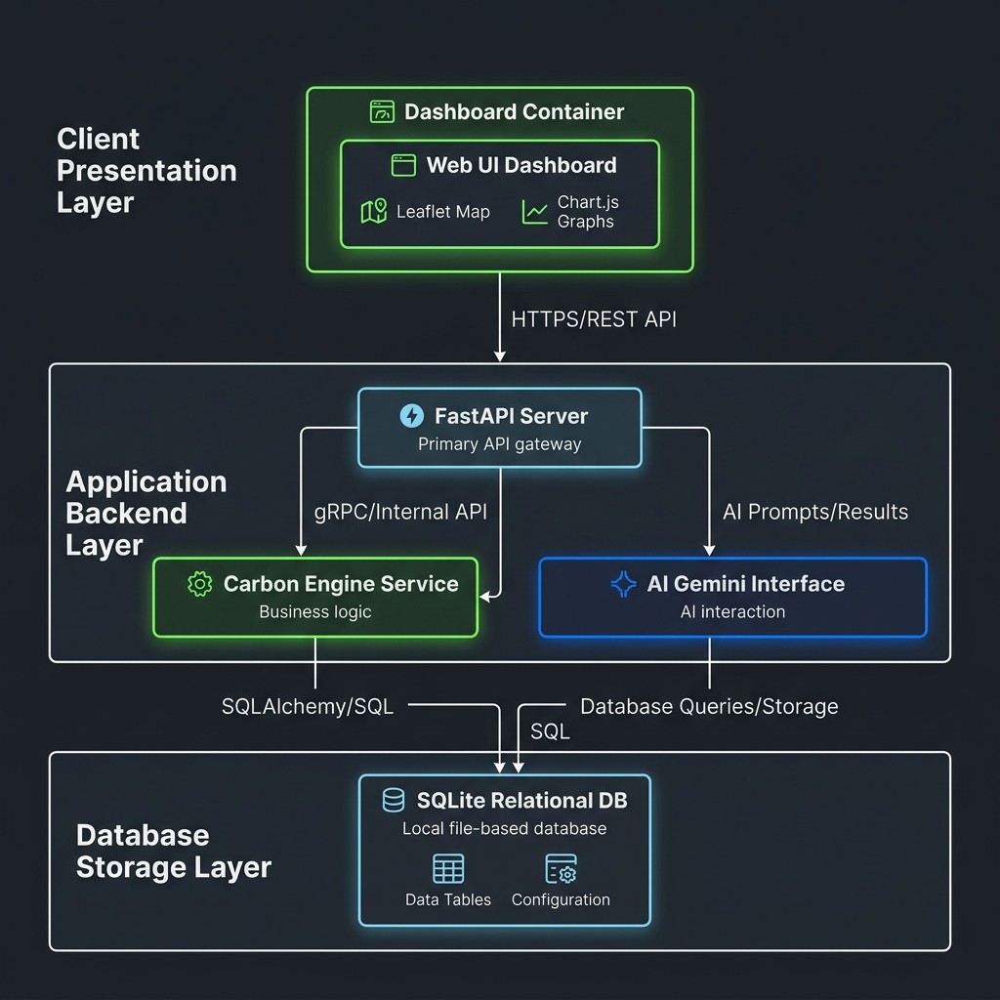
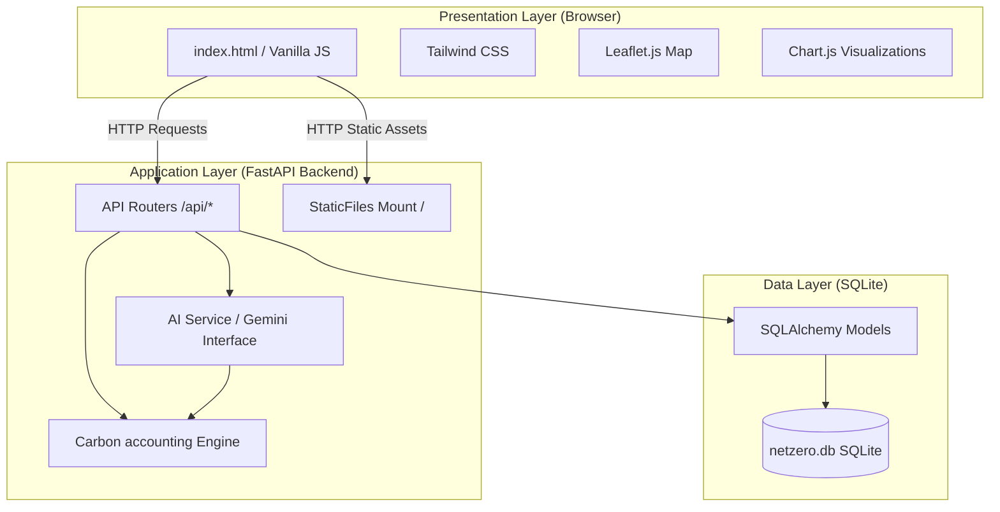
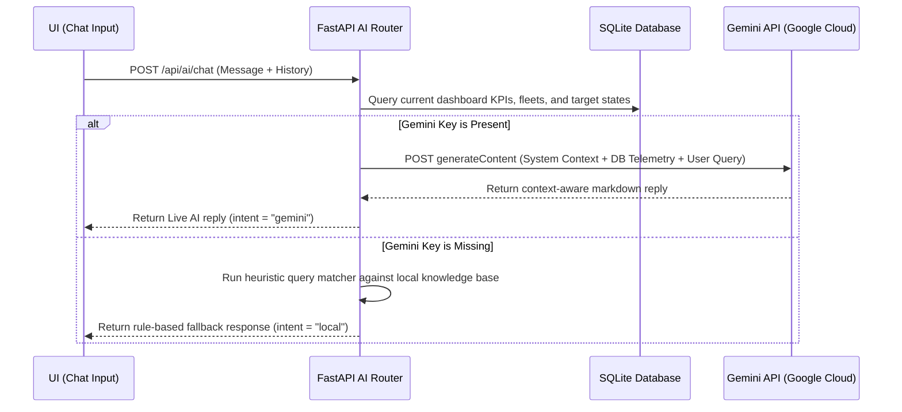

# CarbonPulse System Architecture

This document describes the design, component layers, data flows, and internal calculation engines of the **CarbonPulse** EV Fleet and Carbon Tracking platform.

---

## 🏗️ Architectural Overview

CarbonPulse is designed as a **Single-Origin Monolith** to simplify deployment and local running. The backend (FastAPI) serves both the REST endpoints and mounts the static UI files from the frontend.

## 🖼️ System Architecture Diagram & Explanation

The diagram above details the three distinct tiers of the CarbonPulse architecture:

### A. Client Presentation Layer (Frontend)
The user interface runs inside the client browser as a responsive single-page application:
* **Web UI Dashboard**: Serves as the central container, handling tab switching and layout adjustments.
* **Leaflet Map**: Handles the geospatial route rendering, drawing color-coded paths for logistics corridors and pulsing telemetry city markers.
* **Chart.js Graphs**: Dynamically renders charts for emission trends, asset-class distributions, and trajectory projections.

### B. Application Backend Layer (FastAPI Server)
A Python-based service layer orchestrating API endpoints and carbon logic:
* **FastAPI Server**: Acts as the primary API gateway, routing HTTP requests to REST paths (`/api/*`) and mounting the static frontend assets on the root path (`/`).
* **Carbon Engine Service**: Computes Scope 1 direct combustion, Scope 3 supply chain footprint, and SBTi-aligned reduction target projections.
* **AI Gemini Interface**: Orchestrates telemetry datasets and calls the Gemini API to get context-aware answers, falling back to a heuristic rules processor if necessary.

### C. Database Storage Layer (SQLite)
A local, file-backed relational SQLite database:
* **Data Tables**: Holds core records for `Fleet`, `Route`, `EmissionRecord`, `NetZeroCommitment`, and `Supplier`.
* **Configuration**: Manages initial baselines, coordinates, and operator targets.

---

## 🗂️ Component Descriptions

### 1. Presentation Layer (Frontend)
The frontend is a single-page application (SPA) centered around a modern, dark glassmorphic dashboard:
* **Tailwind CSS**: Translates styling tokens (`DESIGN.md`) into a fluid responsive grid.
* **Chart.js**: Graph engines for:
  * *Emissions Projection Model*: Interactive line chart displaying YTD values vs target roadmaps.
  * *Emissions Breakdown*: Month-over-month comparison of Scope 1 vs. Scope 3.
  * *Carbon Footprint by Asset Class*: Vertical stacked bar chart tracking operational distributions.
* **Leaflet.js**: Renders interactive map overlays with custom geographic paths, colored routes, and pulsing city marker rings for India-wide telemetry.

### 2. Application Layer (Backend)
Built on **FastAPI** to handle high-frequency reporting and AI queries:
* **FastAPI Routers**: Separates resource logic cleanly under `/api/dashboard`, `/api/emissions`, `/api/fleet`, `/api/routes`, and `/api/ai`.
* **Static Files Mount**: Integrates the frontend directly by mounting it on `/`, letting FastAPI serve standard browser requests.

### 3. Business Logic Services
* **Carbon Accounting Engine (`services/carbon_engine.py`)**: Computes greenhouse gas figures using India-specific emission factors (aligned to CEA 2024 factors):
  * **Scope 1**: Direct CO₂ from diesel combustion.
  * **Scope 3**: Indirect CO₂ including grid electricity generation (accounting for clean/renewable energy charging shares) and upstream fuel extraction.
  * **SBTi Trajectory**: Evaluates target metrics based on SBTi 1.5°C pathway rules (4.2% annual reduction target).
* **AI Prioritization Engine (`services/ai_service.py`)**: Orchestrates carbon data and calculates fleet-level readiness scores.
  * Tries to communicate with the **Gemini 1.5 Flash API** to generate live, conversational insights.
  * Falls back to a deterministic, local rule-based fallback model if the API key is not configured.

### 4. Data Layer (SQLite Database)
Utilizes SQLite (`netzero.db`) via SQLAlchemy models:
* **Fleet**: Fleet attributes, operator info, vehicle types, and net-zero targets.
* **Route**: Source/destination cities, coordinates, distance, trips, vehicle types, and emissions.
* **EmissionRecord**: Historical 30-month timeseries of Scope 1, Scope 3, avoided emissions, and targets.
* **NetZeroCommitment**: Strategic corporate roadmap milestones.
* **Supplier**: Battery minerals (Lithium/Cobalt) risk scores and concentration indexes.

---

## 🔄 Core Data Flows

### A. Dashboard Data Loading Flow
1. User loads `http://localhost:8000/`.
2. Browser fetches the HTML and triggers parallel API calls to `/api/dashboard` and `/api/emissions/timeseries`.
3. Backend fetches records from `netzero.db` and computes aggregation fields via the Carbon Accounting Engine.
4. JSON payload returns to the browser; Chart.js renders the lines, and the dashboard metrics update.

### B. Route Visualization Flow
1. User navigates to the **Geospatial Route Map** tab.
2. Leaflet loads dark map tiles from CartoDB.
3. Frontend fetches all routes from `/api/routes`.
4. Route paths are plotted as colored vector polylines:
   * **Green**: Electrified EV Routes.
   * **Amber / Red**: High-intensity diesel routes requiring action.
5. The sidebar is populated with a sorted list of the highest carbon-emitting routes. Clicking a card zooms Leaflet to the route path.

### C. AI Chat Advisor Flow

---

## 🧮 Math & Scoring Models

### 1. Electrification Readiness Index (RI)
Calculates how ready a fleet is for electrification (scored `0` to `100`):
$$\text{Readiness} = \left( \text{EV \%} \times 0.4 + \text{Route Suitability} \times 0.3 + \text{Payload Score} \times 0.2 \right) \times \text{Class Multiplier}$$

* **Route Suitability**: Penalizes fleets traveling more than 100 km/day.
* **Payload Score**: Penalizes heavier loads (harder to electrify).
* **Class Multipliers**: Last-mile (1.2) and intra-plant (1.3) get boosts, while heavy mining (0.6) is penalized.

### 2. Impact Score (Prioritization)
Weights the target carbon impact against operational readiness to rank transition priorities:
$$\text{Impact} = \left(\text{Normalized Annual CO}_2 \times 0.5\right) + \left(\text{Normalized Savings Potential} \times 0.3\right) + \left(\text{Readiness Index} \times 0.2\right)$$
Fractions are normalized against standard industry maxima (5,000 tons annual CO₂ emissions and 3,000 tons savings limits).
