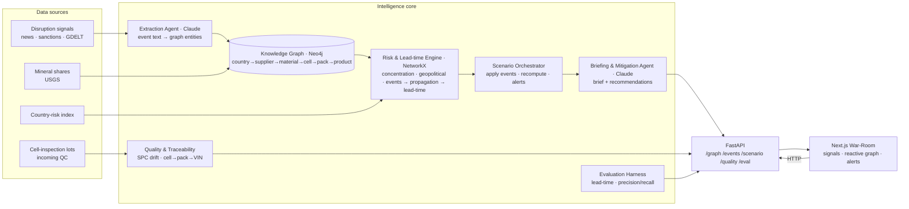

# CellSentry — Architecture

A polished diagram is in [`architecture.svg`](architecture.svg) (use this in the deck).
The Mermaid version below renders directly on GitHub.

## How it works

1. **Data sources** — live disruption signals (news / sanctions / GDELT), USGS mineral country-shares, a country-risk index, and incoming cell-inspection lots.
2. **Extraction Agent (Claude)** — turns free-text events into structured graph entities (materials, countries, suppliers) via forced tool-use; deterministic fallback when no API key.
3. **Knowledge Graph (Neo4j)** — the multi-tier battery supply chain (country → supplier → raw material → component → cell → pack → product), with in-memory fallback.
4. **Risk & Lead-time Engine (NetworkX)** — fuses concentration (HHI), geopolitical, and live event-boost risk, propagates it downstream along the BOM, and computes per-product **lead-time-to-impact** from inventory buffers.
5. **Scenario Orchestrator** — applies selected events, recomputes risk, and emits product alerts.
6. **Briefing & Mitigation Agent (Claude)** — writes the executive brief and recommended actions.
7. **Quality & Traceability** — SPC drift detection over inspection lots with cell→pack→VIN traceability.
8. **Evaluation Harness** — reproducible metrics (below).
9. **FastAPI → Next.js War-Room** — `/graph`, `/events`, `/scenario`, `/quality`, `/eval` power the 3-pane dashboard.

## Verified metrics (`python scripts/run_eval.py` · `GET /api/eval`)

| Metric | Result |
|---|---|
| Detection lead time | **median 19 days** (range 17–21) vs 0 reactive |
| Product attribution | precision / recall **1.0** |
| Quality defect detection (SPC) | **P 0.73 · R 1.0 · F1 0.84** |
