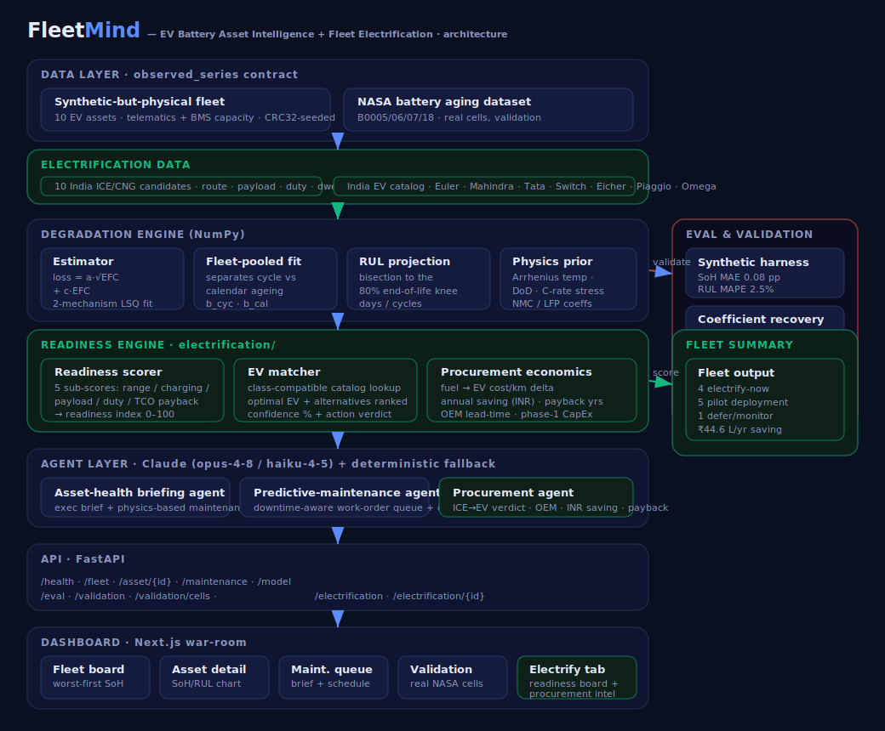

# FleetMind — Architecture



FleetMind is the **fleet-operator** module of the PS3 platform. It covers two
complementary sides of the EV asset lifecycle:

1. **Battery asset intelligence** — SoH, RUL, fade attribution, predictive
   maintenance, and NASA-validated degradation models for an *already-electric*
   fleet.
2. **Electrification readiness & procurement** — operational analysis of an
   ICE/CNG fleet to identify which vehicles should go electric, which India-market
   EV replaces each one, and what the procurement timeline and economics look like.

The whole backend runs with **zero external dependencies** (no database, no API
key required) and degrades gracefully to deterministic behaviour when no LLM key
is configured.

## Data flow

```
Data  ──▶  Degradation engine  ──▶  Agents  ──▶  API  ──▶  Dashboard
                  │
                  └──▶  Eval & Validation  (synthetic + real NASA data)

ICE/CNG fleet data  ──▶  Readiness engine  ──▶  Procurement agent  ──▶  API  ──▶  Electrify tab
India EV catalog    ──/
```

---

## 1. Data layer — `app/data/`

### Battery telemetry
A single observation contract (`observed_series` → `{efc, day, soh_observed}`)
backs both data sources so the exact same model code runs on either:

| Source | What | File |
| --- | --- | --- |
| Synthetic-but-physical fleet | 10 EV assets (e-bus/van/rickshaw, NMC & LFP), weekly BMS capacity + realistic noise, CRC32-seeded for reproducibility | `fleet.py` |
| NASA battery aging dataset | Real cells B0005/06/07/18, per-cycle discharge capacity | `nasa.py` + `nasa_capacity.csv` |

### Electrification inputs — `app/electrification/`
| Source | What | File |
| --- | --- | --- |
| ICE/CNG candidate fleet | 10 India vehicles with operational data: route km, payload, duty cycle, depot dwell, fuel type — across BLR/DEL/MUM/PUN/KOL/AHM/JAI/HYD/CHE | `candidates.py` |
| India EV catalog | Real commercial EVs: Euler HiLoad, Mahindra Treo/Treo Zor, Tata Ace EV/Xpres-T/Starbus EV, Switch IeV4/EiV12, Eicher Pro X, Piaggio Ape E-City, Omega Seiki Rage+ — with range, payload, price (INR), lead-time | `catalog.py` |

---

## 2. Degradation engine — `app/soh/`
The intellectual core of the battery-intelligence side. All NumPy, all deterministic.

- **Estimator** (`estimator.py`) — fits a 2-mechanism fade curve by least
  squares: `1 − SoH = a·√EFC + c·EFC` (SEI √-fade + linear late-life wear-out).
  The two bases are not collinear so both are identifiable per asset.
- **Fleet-pooled fit** (`pooled.py`) — within one constant-duty asset, cycle and
  calendar ageing are collinear. Pooling assets with *different* duty cycles
  breaks the degeneracy and recovers the physical `b_cyc` / `b_cal` coefficients
  (validated to <2.7% of ground truth), giving a data-derived cycle-vs-calendar
  split of each asset's capacity loss.
- **RUL projection** (`rul.py`) — bisection of the fitted curve to the 80%
  end-of-life knee → days (or cycles) remaining + health band.
- **Physics prior** (`degradation.py`) — semi-empirical model (Arrhenius
  temperature, depth-of-discharge and C-rate stress; per-chemistry NMC/LFP
  coefficients) that both generates the synthetic fleet and informs attribution.

---

## 3. Readiness engine — `app/electrification/readiness.py`

Maps each ICE/CNG candidate to its optimal class-compatible EV and produces a
**confidence-scored transition readiness index** from five weighted sub-scores:

| Sub-score | Weight | Logic |
| --- | --- | --- |
| Range fit | 25% | Does the EV's real-world range (85% derate) cover daily km with ≥30% headroom? |
| Depot charging | 25% | Does the dwell window fit the daily recharge? Penalised if no depot return. |
| Payload | 20% | Can the EV carry the required payload? |
| Duty cycle | 15% | Fixed-route + depot-returning = EV-friendly. |
| TCO payback | 15% | Fuel-cost saving vs EV price → payback years; 3yr = full score, 8yr+ = zero. |

A **confidence score** measures how decisive the sub-scores are (marginal scores
near 50 lower confidence). The action verdict is:
- **Electrify now** — index ≥ 72
- **Pilot deployment** — index ≥ 52
- **Defer / monitor** — index < 52

---

## 4. Agent layer — `app/agents/`
Claude (`claude-opus-4-8`, `claude-haiku-4-5` for bulk) with a deterministic
template fallback so the API is always useful:

- **Asset-health briefing agent** — executive health brief + physics-derived maintenance recommendations.
- **Predictive-maintenance scheduler** (`app/ops/schedule.py` + agent) — downtime-aware work-order queue (parallel bays, parts lead time) + ops-plan narrative.
- **Procurement agent** (`procurement.py`) — per-candidate electrification recommendation in INR lakh/crore phrasing: verdict, recommended OEM, delivery lead, annual fuel-cost saving, payback, binding constraint.

---

## 5. API — `app/api/routes.py` (FastAPI)

```
Battery intelligence:  /health · /fleet · /asset/{id} · /maintenance · /model
Eval & validation:     /eval · /validation · /validation/cells
Electrification:       /electrification · /electrification/{id}?brief=true
```

---

## 6. Dashboard — `frontend/` (Next.js + recharts)

| Tab / View | What it shows |
| --- | --- |
| **Fleet** | 3-pane war-room: worst-first health board · SoH/RUL trajectory chart + fade attribution · asset health brief + predictive maintenance queue |
| **Electrify** | 2-col layout: readiness-ranked candidate board (action badge, confidence, lead time) · per-candidate detail (5 sub-score bars, recommended EV tiles, INR running-cost economics, AI procurement brief, alternatives table) + 4 fleet KPI cards (electrify-now count / phase-1 CapEx / fleet fuel saving / avg readiness) |
| **Validation** | Real NASA-cell capacity fade chart + per-cell model-adequacy and knee-onset forecast table |

---

## 7. Eval & Validation — `app/eval/`
- **Synthetic harness** (`harness.py`) — temporal-holdout SoH MAE 0.08 pp, RUL MAPE 2.5%, pooled coefficient recovery max 2.7%.
- **Real-data validation** (`nasa_eval.py`) — model adequacy (full-trajectory in-sample RMSE ≤ 2.0% SoH) + knee-onset forecast (SoH MAE 3.4 pp, RUL median ~21 cycles) on the NASA cells.

---

## Scalability notes
- The observation contract makes new fleets or real datasets drop-in adapters.
- The estimator/pooled fit are closed-form least squares — O(n) per asset, trivially parallel.
- The EV catalog and candidate data are plain Python — replace with a database or API calls with no engine changes.
- Stateless FastAPI + static Next.js scale horizontally; the graph of models is per-asset and embarrassingly parallel.
